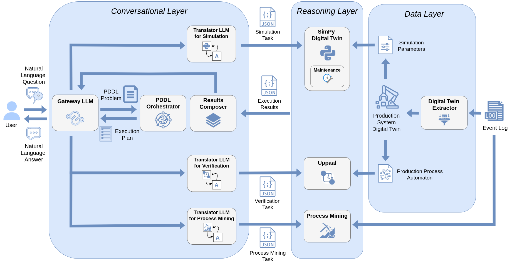

# A Conversational Framework for Faithful Multi-Perspective Analysis of Production Processes

Source code, datasets, and instructions for the paper "*A Conversational Framework for Faithful Multi-Perspective Analysis of Production Processes*".

## About

Production systems call for analysis techniques yielding reliable diagnostic and prognostic insights in a timely fashion. To this end, numerous reasoning techniques have been exploited, mainly within the simulation and formal verification realms. However, the technological barrier between these approaches and the target end users remains a stumbling block to their effective adoption. This paper presents a framework interposing a natural language based interface between the interpretation of the user’s request and the reasoning tools. The user’s natural language request is automatically translated into a machine-readable problem. The latter is then dispatched to a proper reasoning engine and either solved through a simulation or a formal verification task, thus enabling a multi-perspective analysis of the production system and certifying the correctness and transparency of the obtained solutions. The outcome is then reprocessed to be human-interpretable. State-of-the-art Large Language Models (LLMs), with their robust capability to interpret the inherent ambiguity of natural language, perform both translations. We evaluate the framework on a lab-scale case study replicating a real production system. The results of the experiments suggest that LLMs are promising complements to derive insights from faithful reasoning engines, supporting accurate analysis.

## Quick Start: Docker Chatbot

Use this path if you just want to launch the chatbot as a Dockerized web app.

### 1. Clone the repository

```bash
git clone --recurse-submodules https://github.com/angelo-casciani/conv_prod_sys
cd conv_prod_sys
```

### 2. Create the environment file

Create `.env` in the project root with the credentials used by the chatbot:

```env
GOOGLE_API_KEY=<your Gemini API key>
OPENAI_API_KEY=<optional>
DEEPSEEK_API_KEY=<optional>
HF_TOKEN=<optional, only needed for local Hugging Face models>
UPPAAL_LICENSE_KEY=<your Uppaal license key>
```

`UPPAAL_LICENSE_KEY` is required to build and run the verification container.

### 3. Prepare the repository once

```bash
./setup_submodules.sh
```

This script initializes the submodules, builds Fast Downward, prepares the LSHA environment, and sets up the Docker dependencies used by the chatbot stack.

### 4. Put the event log in the input folder

Place the event log you want to analyze inside `log/`.

### 5. Launch the chatbot container stack

```bash
sudo docker compose up --build
```

Then open: `http://localhost:7860`

### 6. Useful commands

```bash
# Stop everything
sudo docker compose down

# Rebuild and restart
sudo docker compose up --build
```

### Runtime files

- `log/`: input event logs
- `runtime_logs/`: chatbot runtime and error logs
- `runtime_logs/interactions/`: user interaction logs

## Architecture



The Figure shows the components of the framework and how they interact.

The framework is designed to provide grounded and interpretable answers to natural language requests concerning a production process, i.e., the representation of the activities performed within a production system. It achieves this through the integration of a *Conversational Layer* and a *Reasoning Layer*. The former tackles the formulation of the problem to be fed to the Reasoning Layer and the interpretation of the results in response to the user. The latter exploits either a digital twin simulating the production process or a formal verifier reasoning on its automaton or process mining module exracting data directly from an event log. Therefore, the approach assumes the availability of an event log allowing the extraction of the simulation parameters to build the digital twin and the automaton modeling the production process. The first one is obtained through an *Extractor* that mines the needed information to build the production system's digital twin, while the second one is provided by a domain expert. Both are not LLM-generated to ensure their correctness.

As illustrated in the Figure, the Conversational Layer includes a set of LLMs: the *Gateway LLM*, which routes the user’s questions, and the *Encoder LLMs* for *Production Simulation*, *Predictive Maintenance*, *Verification* and *Process Mining*, which translate these requests into machine-readable representations compatible with the corresponding reasoners' syntax.

## Structure of the repository

```
.
├── images            # figures for the README file
|   └── architecture.png
├── data              # extracted automaton and simulation parameters
|   ├── automaton     # automaton files (SKG models)
|   |   ├── *_skg.xml            # discovered/selected SKG automaton used for verification
|   |   ├── *.txt                # observable event semantics used for semantic lookup
|   |   └── README.md # automaton directory documentation
|   └── parameters    # digital twin parameters
|       ├── digital_twin_with_failure.json
|       └── digital_twin.json
├── log               # folder where to insert the event log
├── runtime_logs      # runtime logs generated by the Dockerized chatbot
├── server            # server deployment configuration
|   ├── docker-compose.server.yml  # Docker compose for server
|   ├── Dockerfile.chatbot         # Chatbot container build
|   ├── requirements.server.txt    # Lightweight API-only deps
|   └── README.md                  # Server deployment guide
├── src               # source code of proposed approach
|   ├── downward      # Fast-Downward submodule code
|   ├── lsha          # LSHA automaton learning submodule (xes_extension branch)
|   ├── DTLogExtSim   # Digital twin extractor code
|   |   └── Extractor # Extractor component
|   ├── uppaal        # UPPAAL verification engine (download separately)
|   |   ├── bin/      # UPPAAL binaries (verifyta, etc.)
|   |   └── res/      # Contains Dockerfile for building image
|   ├── pddl          # PDDL files for orchestration
|   |   ├── domain.pddl    # Orchestrator PDDL domain
|   |   └── problem.pddl   # Orchestrator PDDL problem
|   ├── extractor_outputs  # outputs from the digital twin extractor
|   ├── automaton_learning.py # SKG extraction with LSHA
|   ├── chatbot.py         # GUI-based conversational interface
|   ├── docker_manager.py  # Docker container lifecycle management
|   ├── main.py            # main entry point for the framework
|   ├── pipeline.py        # orchestration pipeline
|   ├── simulation_interface.py   # LLM-Simulation interface
|   ├── uppaal_interface.py       # UPPAAL verification interface
|   ├── pddl_interface.py         # Planning interface
|   ├── process_mining.py         # Process Mining module
|   ├── failure_interface.py      # failure handling interface
|   ├── failure_maintenance.py    # failure maintenance logic
|   ├── extractor.py              # digital twin extraction logic
|   ├── oracle.py                 # evaluation oracle
|   ├── rnd_bas_eval.py           # evaluation with rng and LLM-only baselines 
|   ├── simulation.py             # simulation implementation
|   ├── test_sets_generation.py   # test set generation script
|   ├── prompts.json              # LLM prompts configuration
|   └── utility.py                # utility functions
├── tests             # sources for the evaluation
|   ├── outputs       # outputs of the live convesations
|   ├── test_sets     # test sets employed during the evaluation
|   |   ├── factory_info.csv
|   |   ├── hybrid.csv
|   |   ├── process_mining.csv
|   |   ├── qualitative_hybrid_requests.txt
|   |   ├── routing.csv
|   |   ├── simulation.csv
|   |   ├── simulation_stats.txt
|   |   ├── unrelated.csv
|   |   └── verification.csv
|   └── evaluation    # quantitative evaluation results for each run
├── docker-compose.yml    # Local Docker services (UPPAAL, Extractor)
├── .env              # environment variables (API keys)
├── .gitmodules       # git submodules configuration
├── setup_submodules.sh  # automated submodule setup script
├── requirements.txt  # Python dependencies
├── LICENSE           # license information
└── README.md         # this file
```

## Setup Notes

### Docker-first usage

For most users, the Docker workflow above is enough. You do not need to create a local Python environment just to run the chatbot web interface.

### Local Python environments

Use local Python environments only if you want to run the CLI, evaluations, or development workflows outside Docker.

**Requires Python 3.11 or higher.**

Main environment:

```bash
python3 -m venv .venv
source .venv/bin/activate
pip install -r requirements.txt
```

LSHA uses a separate conda environment because of dependency conflicts. The recommended setup is still:

```bash
./setup_submodules.sh
```

### Server deployment

For a remote-server deployment, see [server/README.md](server/README.md).

### Interaction Guide

An interaction guide is also provided in [interaction_guide.pdf](interaction_guide.pdf).

## Supported Interfaces

### CLI Interface

This is optional. It is not required for the Dockerized chatbot launch.

Start the conversational framework and interact with it through the command line:

``` bash
python src/main.py
```

The complete conversation will be stored in a `.txt` file in the [outputs](tests/outputs) folder.

The default parameters for the `main.py` are:

* Gateway LLM: `'gemini-2.5-flash'`;
* Simulation LLM: `'gemini-2.5-flash'`;
* Verification LLM: `'gemini-2.5-flash'`;
* Number of generated tokens: `32768`;
* Interaction Modality: `'live'`, i.e., the live chat with the conversational framework.;
* Extracted model: `False`, i.e., the digital twin for simulation will be extracted from scratch;
* Extracted model with failure data: `False`, i.e., the digital twin for predictive maintenance will be extracted from scratch.

To customize these settings, modify the corresponding arguments when executing `main.py`:

* Use `--llm_id_gateway` to specify a different Gateway LLM (e.g., among the ones reported in the *LLMs Requirements* section).
* Use `--llm_id_simulation` to specify a different Encoder LLM for Simulation (e.g., among the ones reported in the *LLMs Requirements* section).
* Use `--llm_id_verification` to specify a different Encoder LLM for Verification (e.g., among the ones reported in the *LLMs Requirements* section).
* Adjust `--max_new_tokens` to change the number of generated tokens.
* Set `--modality` to alter the interaction modality (i.e., `'live'`, `'evaluation-simulation'`, '`evaluation-verification`', `'evaluation-factory_info`', `'evaluation-process_mining`', `'evaluation-hybrid`', '`evaluation-routing`' and '`evaluation-qualitative-hybrid`').
* Use `--extracted_model` to specify if the model has already been extracted (True or False).
* Use `--extracted_model_failure` to specify if the model with failure data has already been extracted (True or False).

A comprehensive list of commands can be found in `src/cmd4tests.sh`.

### Web GUI

The recommended way to use the chatbot is the Docker flow described in [Quick Start: Docker Chatbot](#quick-start-docker-chatbot).

## LLMs Requirements

Please note that this software leverages the open-source and closed-source LLMs reported in the table:

| Model | HuggingFace Link |
| ----- | ---------------- |
| meta-llama/Meta-Llama-3-8B-Instruct | [HF link](https://huggingface.co/meta-llama/Meta-Llama-3-8B-Instruct) |
| meta-llama/Meta-Llama-3.1-8B-Instruct | [HF link](https://huggingface.co/meta-llama/Meta-Llama-3.1-8B-Instruct) |
| meta-llama/Llama-3.2-1B-Instruct | [HF Link](https://huggingface.co/meta-llama/Llama-3.2-1B-Instruct) |
| meta-llama/Llama-3.2-3B-Instruct | [HF link](https://huggingface.co/meta-llama/Llama-3.2-3B-Instruct) |
| mistralai/Mistral-7B-Instruct-v0.2 | [HF link](https://huggingface.co/mistralai/Mistral-7B-Instruct-v0.2) |
| mistralai/Mistral-7B-Instruct-v0.3 | [HF link](https://huggingface.co/mistralai/Mistral-7B-Instruct-v0.3) |
| mistralai/Mistral-Nemo-Instruct-2407 | [HF link](https://huggingface.co/mistralai/Mistral-Nemo-Instruct-2407) |
| mistralai/Ministral-8B-Instruct-2410 | [HF link](https://huggingface.co/mistralai/Ministral-8B-Instruct-2410) |
| Qwen/Qwen2.5-7B-Instruct | [HF link](https://huggingface.co/Qwen/Qwen2.5-7B-Instruct) |
| google/gemma-2-9b-it | [HF link](https://huggingface.co/google/gemma-2-9b-it) |
| microsoft/phi-4 | [HF link](https://huggingface.co/microsoft/phi-4) |
| gpt-4o-mini | [OpenAI link](https://platform.openai.com/docs/models) |
| deepseek-ai/DeepSeek-R1-Distill-Qwen-7B | [HF link](https://huggingface.co/deepseek-ai/DeepSeek-R1-Distill-Qwen-7B) |
| deepseek-ai/DeepSeek-R1-Distill-Llama-8B | [HF link](https://huggingface.co/deepseek-ai/DeepSeek-R1-Distill-Llama-8B) |

Request in advance the permission to use each Llama model for your HuggingFace account.
Retrive your OpenAI API key to use the supported GPT model.

Please note that each of the selected models have specific requirements in terms of GPU availability.
It is recommended to have access to a GPU-enabled environment meeting at least the minimum requirements for these models to run the software effectively.

### Experimental Evaluation

Instructions to reproduce the experimental evaluation results are reported in [src/README.md](src/README.md).

## License

Distributed under the GNU GPL License. See [LICENSE](LICENSE) for more information.